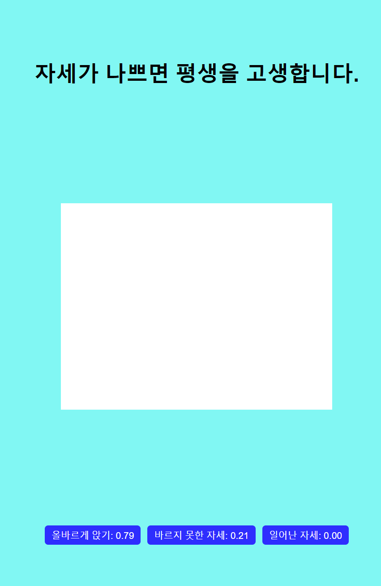
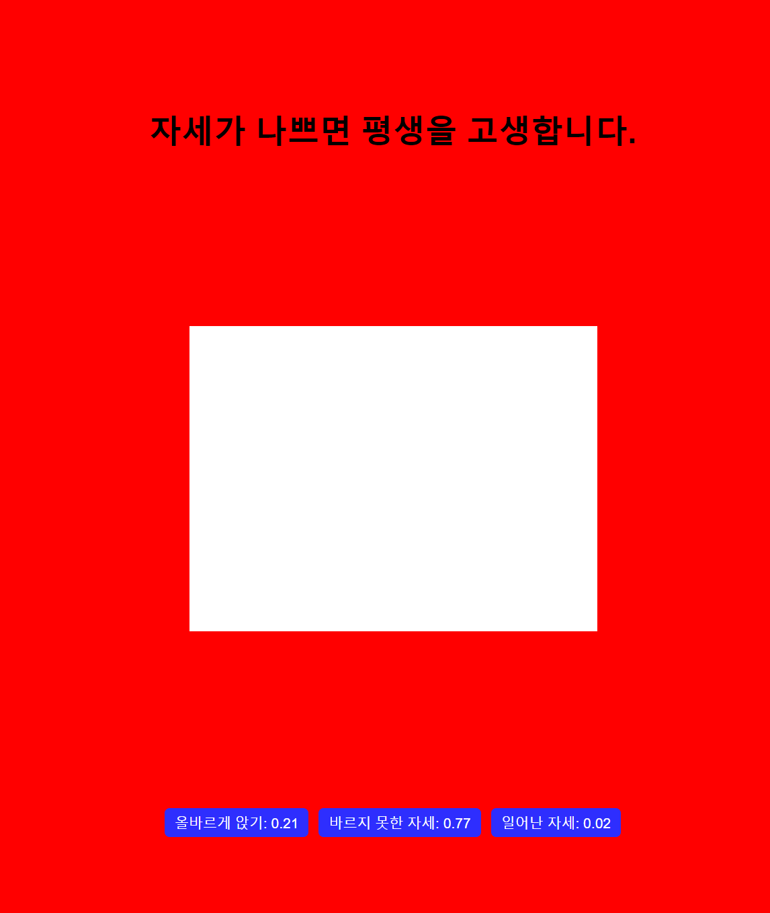
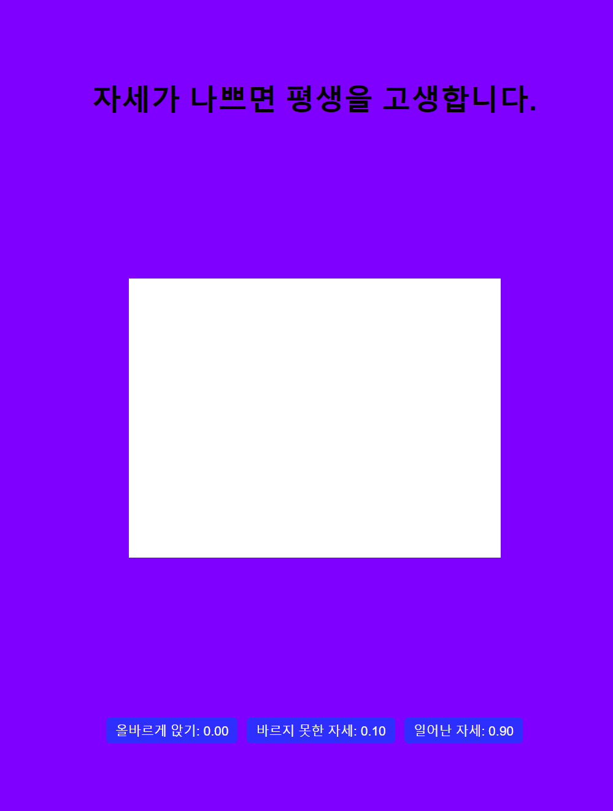

# 현재 자세 상태를 판별하느 프로그램

<a href="https://songseunggun.github.io/TM-02/"> 프로그램 실행 </a>
  
1. 위 텍스트를 클릭 시 프로그램 실행화면으로 전환

## 실행 화면

 

2. 전환된 화면에서 확인하기 버튼을 클릭 시 -> 카메라 촬영 시작  
3. 실시간으로 기기와 연결된 카메라로 실시간 녹화를 하며 프로그램이 작동   
4. 자세에 따라 비중이 달라지는데 [ 0.5 ] 즉 50% 가 넘어가면 해당 실행되는 클래스에 따라 배경색이 자동으로 변경   

## 올바른 자세 클래스 실행

## 바르지 못한 자세 클래스 실행

 

## 일어난 자세 클래스 실행

